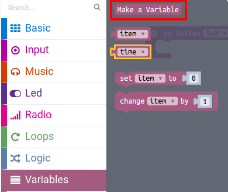
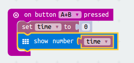
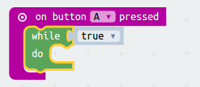
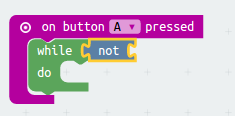
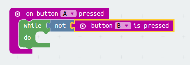
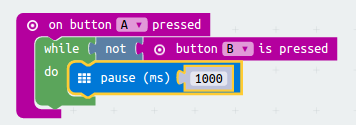
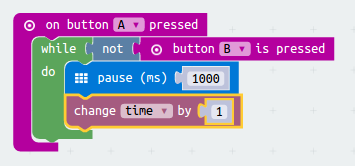
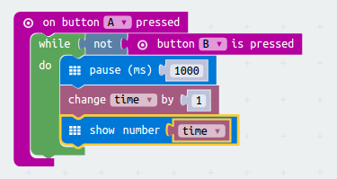

# Introduction { .intro }

You are going to learn how to make a timer, so that you can use it to challenge your friends!

__Instructions__: If you're reading this online, press __A+B__ on the micro:bit below to set your timer to 0, __A__ to start your timer, and __B__ to stop it.

<iframe style="position:absolute;top:0;left:0;width:100%;height:100%;" src="https://pxt.microbit.org/---run?id=55342-38825-28229-57221" allowfullscreen="allowfullscreen" sandbox="allow-popups allow-scripts allow-same-origin" frameborder="0"></iframe>

# Step 1: Setting up your timer { .activity }

Let's set your timer to 0 when buttons A and B are pressed together.

## Activity Checklist { .check }

+ Go to <a href="http://jumpto.cc/pxt-new" target="_blank">jumpto.cc/pxt-new</a> to start a new project in the Code Kingdoms editor. Call your new project 'Timer'.

+ Delete the `on start` and `forever` blocks, as you don't need them.

+ Name your project 'Against the Clock'.

+ Add a new `on button pressed event` and select `A+B`:.

	

+ Click the 'Variables' then 'Make a variable', and create a new variable called `time`.

	

+ When buttons A and B are pressed together, you want the `time` to be set to `0`. To do this, drag a `set` block into your `on button A+B pressed` block:

	

The default value of zero is what you need. 

+ You should also display the `time`. To do this, drag in a `show number` block and drag your `time` variable into it:

	

+ Click 'run' to test your code. Press the 'A+B' button (below the micro:bit) to set your timer to 0.

	

# Step 2: Starting and stopping your timer { .activity }

Let's use button A to start your timer, and button B to stop it.

## Activity Checklist { .check }

+ Your timer should start when button A is pressed. Add a new `on button A pressed` block to your script:

	

+ The timer should count up as long as button B __has not been pressed__. To do this, first drag a `while` block into your new `on button A pressed` event.

	

+ Drag a `not` block, from 'Logic' to your `while` block:

	

+ You can then drag a `button B pressed` block after the `not` block.

	

	Any code inside this `while` loop will be run repeatedly, __as long as button B has not been pressed__.

+ Next, you want to add 1 to your `time` variable every second (1 second = 1000 ms). Add a `pause` block to make your timer wait for 1 second.

	

+ To increase your `time` variable,

	

+ Finally, you'll need to display the updated `time` variable. Here's how your code should look:

	

+ Click 'run' to test your code.

	+ Press buttons A and B together to set your timer to 0
	+ Press button A to start your timer
	+ Press (and hold) button B to stop your timer

	

## Challenge your friends! { .challenge }
Use the timer to challenge your friends. For example, you could see how long it takes them to say the alphabet backwards, or name 10 capital cities.

## Challenge: Counting Down { .challenge }
Can you create a __new__ timer, that counts down to 0? Here's how your new timer should work:

+ Pressing buttons A and B together should set your `timer` to 0

	

+ Pressing button B should add 1 to your timer

	

+ Pressing button A should take 1 from your `time` variable until it gets to 0. This means you'll need a `while` loop that runs as long as the `time` is greater than (`>`) 0.

	