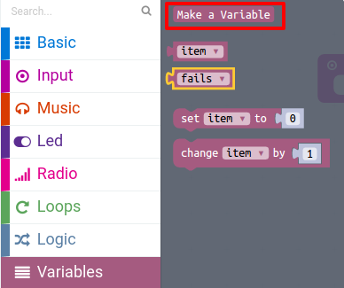

# Introduction { .intro }

You are going to make a game in which players have to guide a wand along a course without making contact. Making contact will add one to the player's score - the player with the lowest score wins!

For this project you'll need some additional items:

+ Metal wire (approx. 50cm);
+ Modelling clay (Plasticine or similar, needs to be non-conductive);
+ Electrical tape (optional);
+ Crocodile clip leads (optional).

# Step 1: Storing fails { .activity }

Let's start by creating a place to store the number of fails.

## Activity Checklist { .check }

+ Go to <a href="http://jumpto.cc/pxt-new" target="_blank">jumpto.cc/pxt-new</a> to start a new project in the PXT editor. Call your new project 'Frustration'.

+ Delete the `forever` and `start` blocks by dragging them to the palette:

+ A new game should start when the player presses button A. Click 'Input' and then `on button A pressed`.

+ Now you need a variable to store the number of times you fail in the game by touching the wire with the wand. Click on 'Variables' and then 'Make a new Variable'. Name the variable `fails`.

+ Drag a `set` block from 'Variables' and select `fails`:

This will set the number of fails to zero when you press the A button. 

+ Finally, you can display the number of `fails` on your micro:bit. To do this, first drag a `show number` block from 'Basic' to the end of your script.

+ Then drag `fails` from 'Variables' into your `set block`.

	
+ Click 'run' to test your script. Clicking button A should display the number of fails, which has been set to `0`.

## Challenge: Display an image { .challenge }	
Can you display an image for 1 second (1000ms) before the number of `fails` are displayed?

You'll need to use the following blocks from Basic do to this:

# Step 2: Keeping track of fails { .activity }

Let's add code to keep track of fails.

## Activity Checklist { .check }

+ You're going to add 1 to your `fails` variable every time a connection is made on Pin0. To do this, drag `on pin P0 pressed` from 'Input'.

+ Next, add 2 blocks to display a cross for 1 second when Pin0 is pressed.

+ You'll then need to add 1 to your `fails` variable. To do this, click the drag a `change item by 1` from Variables and change `item` to `fail`. 

+ Finally, you can add code to display the updated number of fails. Here's how your code should look.

+ Test your code by pressing button A on the emulator to start your game. Each time you press Pin0 you should see your `fails` variable increase by 1.

+ Click 'Download' and transfer your script onto your micro:bit. You can press Pin0 by completing a circuit. To do this, place your right thumb on the ground pin (GND) and then tap Pin0 with your left thumb.

# Step 3: Building your game { .activity }

Now that you've coded your game, let's put it all together!

## Activity Checklist { .check }

+ First, let's make your wand. Take a piece of wire about 20cm long and bend it in half, making a loop at the top.

+ You can then twist the two pieces of wire together.

+ To make the course, take another piece of wire about 30cm long and bend the middle part of the wire into shape. You should bend up one end of the course.

+ If you have some electrical tape, wrap some around the two ends of the wire, leaving some exposed metal at both ends.

+ Slide your wand through your course, and push the ends of your wire into some putty to stand it up.

+ You can now connect your game to your micro:bit using a crocodile clip lead or some wire. Firstly, connect the ground pin (GND) to one end of your course.

+ You can then connect Pin 0 to your wand.

+ Test your game. Press button A and your score should be set to 0. Each time your wand touches the course, the circuit is completed and your micro:bit should add 1 to your number of fails.

## Challenge: Cheat mode! { .challenge }
Can you add a cheat to your game, so that pressing button B reduces your score by 1?

## Challenge: Personalise your game { .challenge }
Get some friends to try out your game. If your game is too easy, you can make it harder by:

+ Create a longer course;
+ Add more bends to your course;
+ Make a wand with a smaller gap.
