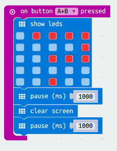
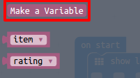
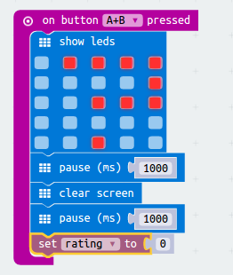
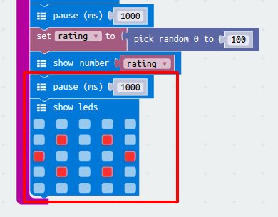
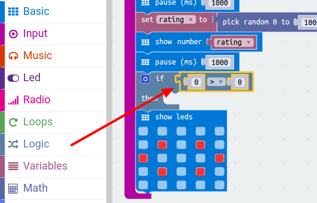
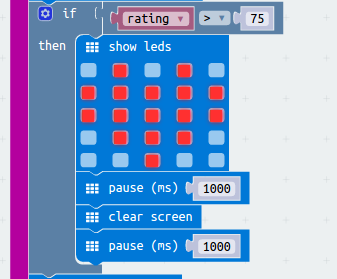
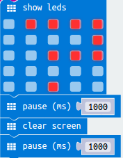

# Introduction { .intro }

You are going to code your micro:bit to tell you how compatible you are with your friends.

__Instructions__: If you're reading this online, press __A+B__ on the micro:bit below with a friend to find out your friendship rating.

<iframe style="position:absolute;top:0;left:0;width:100%;height:100%;" src="https://pxt.microbit.org/---run?id=57756-45098-79806-84952" allowfullscreen="allowfullscreen" sandbox="allow-popups allow-scripts allow-same-origin" frameborder="0"></iframe>

# Step 1: Pressing buttons together { .activity }

Let's start your program when the A and B buttons are pressed together.

## Activity Checklist { .check }

+ Go to <a href="http://jumpto.cc/pxt-new" target="_blank">jumpto.cc/pxt-new</a> to start a new project in the PXT editor. Call your new project 'Rate Your Mates'.

+ When the micro:bit starts, display an image showing that both buttons should be pressed.

You can use scrolling text instead of an image if you prefer.

+ A rating shouldn't be shown until __both buttons are pressed__. Add a new `on button A+B pressed` event to your project.

+ Add code to show a question mark for 1 second, to build the suspense before giving the friends their rating.

+ Test our your code. When you press buttons __A and B together__, a question mark should flash onto the screen.

# Step 2: Displaying a rating { .activity }

Show a friendship rating on the screen.

## Activity Checklist { .check }

+ Click 'Variables' and make a new variable called `rating`.

+ Drag a `set` block to the end of your `on button A+B pressed` code and select the `rating` variable:

+ Click 'Math', and use the `pick random` block to set the rating to a random number between 0 and 100.

+ Add code to show the rating on the screen.

+ Finally, after a delay, display the instructions again. Remember that you can use right-click then 'Duplicate' to copy a block.
    

+ Test your code. Now, if you press buttons A and B together, a random rating should be displayed.

# Step 3: Best mates { .activity }

Let's display a heart when two friends have a high rating.

## Activity Checklist { .check }

+ Add an `if` block to your code, just before the instructions are shown.

+ You want to display a heart if the rating is high (say over 75). To do this, drag a comparison block from 'Logic' to your 'if' and select '>':

+ Drag your `rating` variable into the left side of your `if` block, and add the number `75` to the right side.

Any code inside this `if` block will run if the rating is over 75.

+ Show a heart image on the screen for 1 second if the rating is over 75.

+ Test your code. Does an image of a heart show if the rating is over 75? You might have to try a few times to test it!

## Challenge: Low rating { .challenge }
Can you display a cross or a sad face for a rating under 25?

# Step 4: Adding an animation { .activity }

Let's display short animations in your program.

## Activity Checklist { .check }

+ Here's the code for displaying a question mark for 1 second before clearing the screen:

+ To make this question mark flash 5 times, you'll need to put this code inside a `repeat` loop and set the number of repeats to '5':

## Challenge: More animations { .challenge }
Can you make your other images flash on the screen?
